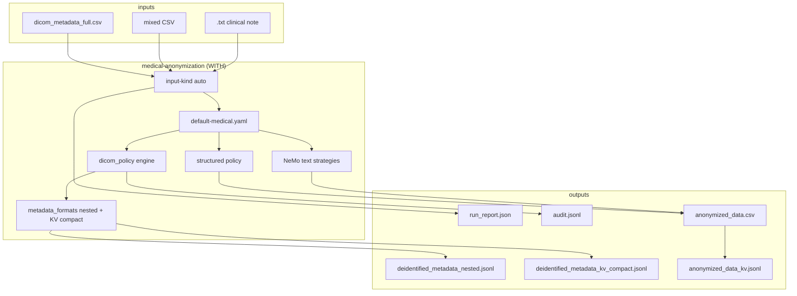
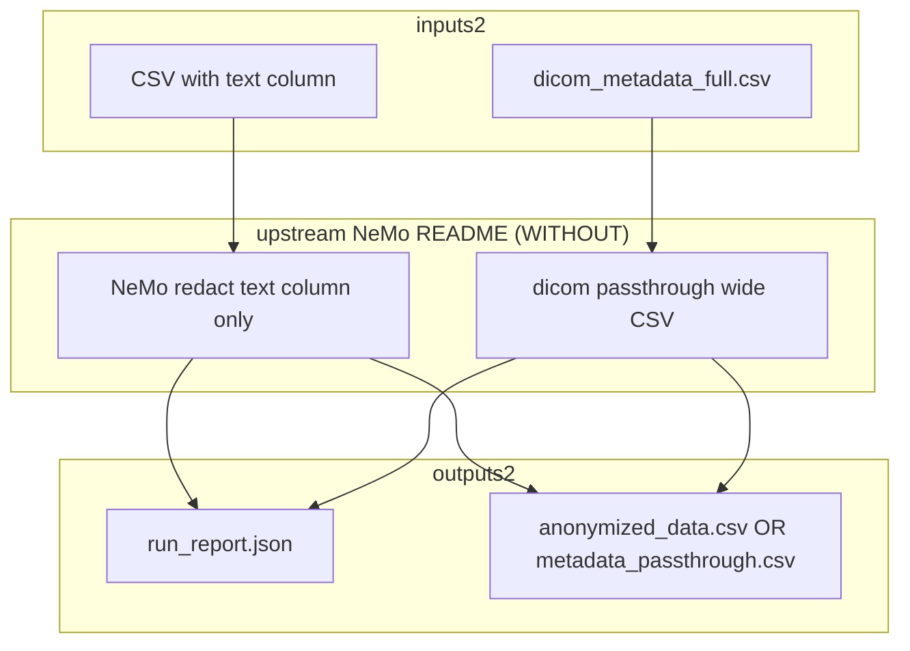

# Medical Anonymization — With vs Without Skill

Engineering comparison: `medical-anonymization/SKILL.md` vs upstream NeMo README baseline on the same staged inputs.

## Failure modes tracked

| Mode | Meaning |
|------|---------|
| `invocation_nonzero_exit` | Script crashed or nonzero return |
| `missing_run_report` | No `run_report.json` |
| `missing_nested_jsonl` | No per-study nested JSONL (with-skill contract) |
| `missing_kv_compact_jsonl` | No `(record_id, field, value)` JSONL |
| `missing_audit_jsonl` | No shareable audit log |
| `missing_anonymized_csv` | No wide CSV output |
| `dicom_phi_field_leak` | Direct identifier unchanged vs source |
| `dicom_uid_not_remapped` | UID identical to source |
| `structured_id_not_hashed` | MRN/ID column left verbatim |
| `kv_round_trip_failed` | KV cannot reconstruct nested |
| `nemo_pipeline_failed` | NeMo records_failed > 0 |
| `text_bracket_token_missing` | No redaction tokens in text output |
| `no_structured_policy_applied` | Expected without-skill gap on DICOM/CSV |
| `no_format_evaluation` | Missing token/format comparison report |

## With-skill workflow



**Entrypoint:** `scripts/anonymize_medical_data.py`

## Without-skill workflow



**Entrypoint:** `scripts/without_skill_baseline.py` (text) or passthrough (DICOM)

**Gaps without skill:** no YAML policy, no JSONL formats, no audit, no structured-field hashing, no UID remap/date-shift.

## Run evaluation

```bash
/home/marc/.conda/envs/reports-openai/bin/python \
  skills/medical-anonymization/scripts/run_with_vs_without_eval.py \
  --output-dir /tmp/medical_anon_with_vs_without \
  --report-num-records 3
```

Outputs: `with_vs_without_report.json`, `with_vs_without_report.md`

## Results (2026-07-11, local PHI-safe)

Harness: `run_with_vs_without_eval.py` with GLiNER @ `172.20.0.1:8001`, Ollama `medgemma:27b`.

| Task | with (s) | without (s) | with pass | without pass |
|------|--------:|------------:|:---------:|:------------:|
| dicom-metadata | 3.2 | 1.6 | yes | yes (expected `no_structured_policy_applied`) |
| ehr | 16.9 | 23.7 | yes | yes (expected `structured_id_not_hashed`) |
| reports | 32.9 | 43.8 | yes | yes |

See [`with-vs-without-results.md`](with-vs-without-results.md) for the full JSON report.
